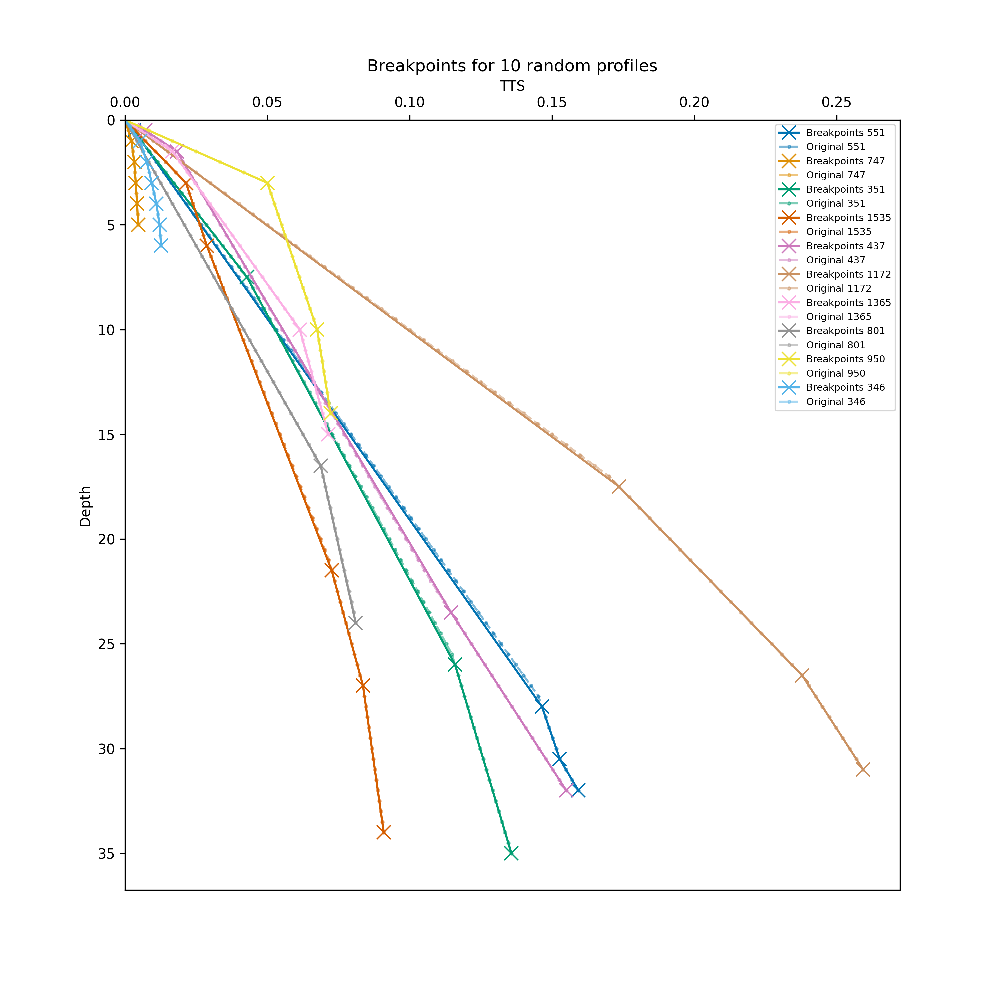
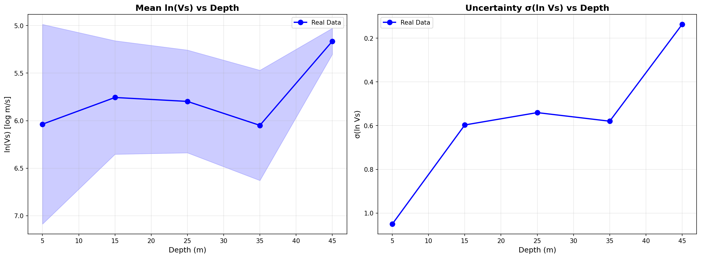
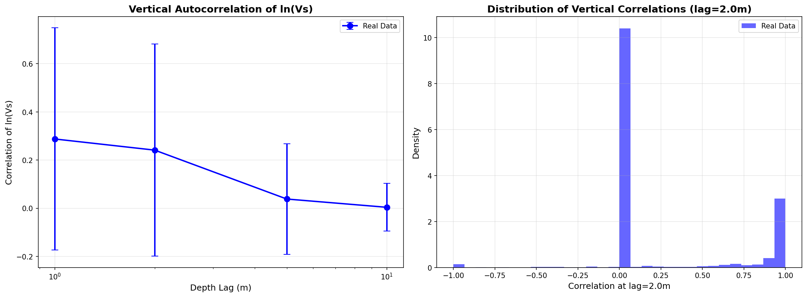

# Generative AI project on Spatial-Correlated Soil Profiles

[](https://github.com/KurtSoncco/gen-ai-soil-profiles)
[](https://www.python.org/)
[](https://github.com/KurtSoncco/gen-ai-soil-profiles/actions)
[](https://github.com/astral-sh/uv)
[](https://opensource.org/licenses/MIT)
[](https://github.com/KurtSoncco/gen-ai-soil-profiles/stargazers)

This repository explores generative AI techniques for synthesizing realistic, spatially-correlated shear-wave velocity (Vs) soil profiles for geotechnical and seismic-hazard applications. It progresses from closed-form parametric/stochastic baselines to deep generative models (VAE, GAN) and, most recently, a **Transformer-based Conditional Flow Matching** model that generates variable-length, physically-constrained profiles directly from real borehole data.

[Research Questions](#-research-questions--hypothesis) • [Methodology](#️-methodology) • [Flagship Model](#-flagship-model-transformer-conditional-flow-matching) • [Data](#-data) • [How to Reproduce](#-how-to-reproduce) • [Key Results](#-key-results)

---

## 🎯 Research Questions / Hypothesis

- Can a generative model learn a realistic, physically-plausible distribution of Vs(z) profiles — including their vertical (depth-wise) spatial correlation structure — directly from real borehole measurements?
- Does representing a profile as a variable-length sequence of layer "breakpoints" (rather than a fixed-length vector) let a single model handle profiles of arbitrary depth and layering complexity?
- Do physics- and geostatistics-informed loss terms (velocity bounds, depth-dependent statistics, vertical autocorrelation) measurably improve the realism of generated profiles over an unconstrained baseline?

---

## 🛠️ Methodology

The repo is organized as a progression of experiments, each in its own directory under [`experiments/`](experiments/), moving from simple closed-form baselines toward increasingly expressive, data-driven, physics-aware generative models:

| Approach | Directory | Profile representation | Model family | Role |
|---|---|---|---|---|
| Parametric curves | [`experiments/parametric`](experiments/parametric) | Exponential / power-law / layered function params | GMM, MLP-VAE over parameters | Interpretable baseline |
| Stochastic sampling | [`experiments/stochastic_approach`](experiments/stochastic_approach) | Two-way travel time (TWT) vs. depth | Bayesian power-law (NumPyro MCMC), Genetic Algorithm | Uncertainty-aware baseline |
| Deep generative (fixed-length) | [`experiments/VAE`](experiments/VAE), [`experiments/conv1d_gan`](experiments/conv1d_gan) | Fixed-length, resampled Vs(z) vector | Conv1D VAE / VQ-VAE, Conv1D GAN | Quantitative benchmark (published metrics, see below) |
| Flow matching feasibility studies | [`experiments/synthetic_toy_profiles_flow_matching`](experiments/synthetic_toy_profiles_flow_matching), [`experiments/vs_pairs_flow_matching`](experiments/vs_pairs_flow_matching) | 2-layer toy profiles / 4D [vs30, vs50, vs100, vs200] | UNet & FNO / MLP & FNO unguided flow matching | Validate flow matching mechanics before scaling up |
| **Flagship: Transformer Flow Matching** | [`experiments/flow_matching_simplified`](experiments/flow_matching_simplified) | **Variable-length [travel-time, depth] breakpoint tokens** | **Transformer-based Conditional Flow Matching, physics + geostatistics regularized** | **Latest & most advanced model** |

All experiments share the same underlying data source (real Vs profiles, see [Data](#-data)) and the same core modeling assumption: Vs is treated as approximately **log-normally distributed with depth**, so `log1p(Vs)` is the working variable that generative models are trained to reproduce, and outputs are mapped back with `expm1`.

---

## 🌊 Flagship Model: Transformer Conditional Flow Matching

[`experiments/flow_matching_simplified`](experiments/flow_matching_simplified) is the most recently added and architecturally most advanced model in the repo. It generates full-depth Vs profiles for real, variable-layering boreholes rather than fixed-length or toy vectors.

### Why Flow Matching
Conditional Flow Matching trains a neural vector field `v_θ(u, t)` to transport samples along a straight-line (optimal-transport) path between Gaussian noise (`t=0`) and real data (`t=1`), using a simple regression loss instead of an adversarial objective (GAN) or an evidence lower bound (VAE). Generation is deterministic ODE integration (4th-order Runge-Kutta, 50 steps by default), which is cheaper and more stable to train than a full diffusion model while retaining the ability to model complex, multi-modal distributions.

### Key techniques
- **Breakpoint tokenization**: each profile is compressed into a variable-length sequence of `[two-way travel time, depth]` pairs at layer boundaries — a piecewise-linear "tokenization" of Vs(z). This lets one model handle profiles with different numbers of layers, unlike the fixed-length vectors used by the VAE/GAN baselines.
- **Per-profile normalization + sequence-stats conditioning**: each token sequence is z-score normalized using its *own* mean/std (so the network operates in a consistent unit-scale space), while the original `[ts_mean, ts_std, depth_mean, depth_std]` are fed back in as a conditioning vector — letting the model reconstruct each profile's absolute scale.
- **Transformer encoder + sinusoidal time embedding**: a 4-layer, 8-head Transformer (256-dim) with positional encoding across breakpoint order, conditioned on a sinusoidal embedding of the flow-matching time variable `t`.
- **Depth convolution block**: a shallow 1D convolution (kernel size 3) applied along the depth/layer axis with a residual connection, added specifically to improve short-lag (1–2 m) vertical coherence between neighboring layers.
- **Physics-informed Vs regularization**: velocities implied by each generated `[Δts, Δdepth]` pair are penalized during training if they fall outside a physically reasonable range (100–5000 m/s), instead of only filtering invalid samples post-hoc.
- **Geostatistics-informed auxiliary losses**: a *depth-dependent statistics loss* (matching the depth-binned mean/std of `ln(Vs)`) and a *vertical correlation loss* (matching the empirical autocorrelation of `ln(Vs)` at short lags) pull the generated population toward the real spatial-correlation structure — directly addressing the project's spatial-correlation research question.

### Assumptions
- A modest number of piecewise-linear breakpoints (≤ 20 layers) is an adequate approximation of real Vs(z) stratigraphy; continuously-varying profiles (e.g. CPT-derived) would lose fidelity under this representation.
- Depth-binned `ln(Vs)` mean/std and vertical autocorrelation are treated as approximately stationary within a depth bin across the profile population — a standard simplifying assumption borrowed from geostatistics, not a claim that soil is literally homogeneous.
- Per-profile normalization assumes each profile's scale is fully recoverable from four summary statistics; this is what makes the sequence-stats conditioning vector necessary.
- Vs is bounded to [100, 5000] m/s, based on physically plausible shear-wave velocities for near-surface soil and rock.

### Figures


*Figure 1 — Ten real profiles (dots) reduced to their piecewise-linear breakpoint tokens (X markers) in travel-time/depth space. This variable-length breakpoint sequence is the input representation learned by the flow matching model.*


*Figure 2 — Depth-binned mean and standard deviation of `ln(Vs)` computed from real VSPDB profiles. These are the target statistics the depth-dependent statistics loss pulls generated profiles toward.*


*Figure 3 — Empirical vertical autocorrelation of `ln(Vs)` vs. depth lag (left), and its full distribution at a 2 m lag (right). The vertical-correlation loss encourages generated profiles to reproduce this decay, which is the core spatial-correlation signal this project targets.*

This flagship model builds directly on the two flow matching feasibility studies also in the repo — [`synthetic_toy_profiles_flow_matching`](experiments/synthetic_toy_profiles_flow_matching) and [`vs_pairs_flow_matching`](experiments/vs_pairs_flow_matching) — which first validated that flow matching could learn simple 2-layer and 4D Vs-summary distributions before scaling up to full, variable-length, physics-and-geostatistics-constrained real profiles.

> **Note on quantitative results**: no trained checkpoint is committed to this repository, so no final generation-vs-real benchmark numbers are published here yet. Running `experiments/flow_matching_simplified/comprehensive_eval.py` after training reports monotonicity rate, physical-depth and Vs-bound satisfaction rates, pairwise diversity, and KS-statistics between generated and real Vs/breakpoint distributions, plus the side-by-side profile and histogram plots used to produce figures like the ones above. See [Key Results](#-key-results) for the closest currently-published numeric baseline (the VAE model).

---

## 💾 Data

- **Primary source**: the [Vs Profile Database (VSPDB)](https://www.vspdb.org), a repository of real geotechnical shear-wave velocity measurements, fetched via an authenticated API client ([`scripts/vspdb_request_data.py`](scripts/vspdb_request_data.py), [`soilgen_ai/apis`](soilgen_ai/apis)). Credentials (`AUTH_VSPDB_API_EMAIL`, `AUTH_VSPDB_API_PASSWORD`) are read from a local `.env` file and are **not** committed to the repo.
- A secondary Japanese Vs profile dataset is supported via [`scripts/japan_data.py`](scripts/japan_data.py).
- Synthetic datasets used for the flow matching feasibility studies are generated locally: [`scripts/generate_synthetic_profiles.py`](scripts/generate_synthetic_profiles.py) (2-layer toy profiles) and [`scripts/extract_vs_pairs.py`](scripts/extract_vs_pairs.py) (4D Vs-pair summaries extracted from full profiles).
- Preprocessing common to most experiments: conversion of Vs(z) to two-way travel time vs. depth, `log1p` transform + normalization, and (for the flagship model) compression to variable-length `[ts, depth]` breakpoint sequences.
- Raw data is intentionally **not committed to Git** (`data/` only tracks a `.gitkeep`); reproduce it locally using the scripts above.

---

## 🚀 How to Reproduce

1.  **Clone the repository:**
    ```bash
    git clone https://github.com/KurtSoncco/gen-ai-soil-profiles.git
    cd gen-ai-soil-profiles
    ```
2.  **Create and activate a virtual environment using `uv`:**
    ```bash
    pyenv local 3.11
    uv venv
    source .venv/bin/activate
    ```
3.  **Sync dependencies using `uv`:**
    ```bash
    uv sync --extra dev
    ```
4.  **Run the test suite:**
    ```bash
    pytest
    ```
5.  **Fetch/prepare data** (requires VSPDB credentials in `.env` for real profiles):
    ```bash
    python scripts/vspdb_request_data.py
    python scripts/extract_vs_pairs.py               # for the Vs-pairs feasibility experiment
    python scripts/generate_synthetic_profiles.py     # for the toy-profile feasibility experiment
    ```
6.  **Train the flagship flow matching model:**
    ```bash
    python -m experiments.flow_matching_simplified.train

    # or the physics/geostatistics-aware variant with depth-dependent losses
    ./experiments/flow_matching_simplified/depth_dependent_stats/train_model.sh
    ```
7.  **Evaluate a trained checkpoint:**
    ```bash
    python -m experiments.flow_matching_simplified.comprehensive_eval
    ```
    Other experiments (VAE, Conv1D GAN, parametric, stochastic) each have their own `run_experiment.py` and README — see the table in [Methodology](#️-methodology).

---

## 📊 Key Results

The figures in [Flagship Model](#-flagship-model-transformer-conditional-flow-matching) show the input representation and the real-data statistics that drive the flow matching model's physics- and geostatistics-informed losses. Full generated-vs-real benchmark plots for that model are produced by its evaluation scripts once a checkpoint is trained (see the note above).

The most recent **published** quantitative benchmark in the repo comes from the Conv1D VAE ([`experiments/VAE`](experiments/VAE)), included here as the current numeric reference point:

| Metric | Real | Generated |
|---|---|---|
| Vs30 mean (m/s) | 219.28 | 221.84 |
| Vs30 std (m/s) | 132.96 | 115.83 |
| KS statistic (Vs30 distribution) | — | 0.0959 (good match) |
| Mean ratio (generated/real) | — | 1.0117 |
| Std ratio (generated/real) | — | 0.8712 |

As the flagship flow matching model is evaluated end-to-end, its metrics should be added here alongside the VAE baseline for direct comparison.
